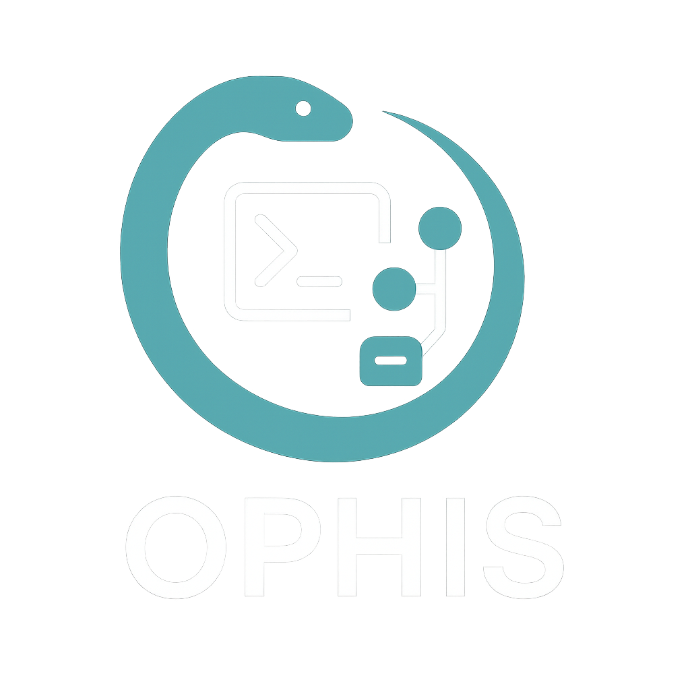

**Transform any Cobra CLI application into an MCP (Model Context Protocol) server**

Ophis is a Go library that automatically converts Cobra-based command-line applications into MCP servers, allowing AI assistants and other MCP clients to interact with your CLI tools through structured protocols.

## Motivation

- Transform your Cobra CLI to an MCP server with **one command**
- Expose CLIs to AI assistants without exposing shell access
- Bridge the gap between command-line tools and AI workflows
- Maintain security by controlling exactly which commands are exposed

## Features

- **Automatic Tool Registration**: Recursively discovers and registers all Cobra commands as MCP tools
- **Flag Support**: Maps Cobra flags to MCP tool parameters with proper type detection
- **Positional Arguments**: Handles command-line arguments through a dedicated parameter
- **Command Hierarchy**: Preserves the structure of nested subcommands
- **Clean State Management**: Each command execution uses a fresh command instance
- **Claude Desktop Integration**: Built-in commands to enable/disable MCP servers in Claude Desktop
- **Type-Safe Parameter Mapping**: Intelligent detection of flag types (string, int, bool, arrays, etc.)

## Installation

```bash
go get github.com/njayp/ophis
```

## Quick Start

### 1. Implement Command Factory.

The `CommandFactory` interface provides flexibility for command creation and execution:

```go
type CommandFactory interface {
    // Tools returns the list of available MCP tools
    Tools() []tools.Tool
    
    // New creates a fresh command instance and execution function
    New() (*cobra.Command, CommandExecFunc)
}
```

An example `CommandFactory`:

```go
package main

import (
	"context"
	"strings"

	"github.com/mark3labs/mcp-go/mcp"
	"github.com/njayp/ophis/bridge"
	"github.com/njayp/ophis/tools"
	"github.com/spf13/cobra"
)

// CommandFactory implements the bridge.CommandFactory interface for make commands.
type CommandFactory struct {
	rootCmd *cobra.Command
}

// Tools returns the list of MCP tools from the command tree.
func (f *CommandFactory) Tools() []tools.Tool {
	return tools.FromRootCmd(f.rootCmd)
}
// New creates a fresh command instance and its execution function.
func (f *CommandFactory) New() (*cobra.Command, bridge.CommandExecFunc) {
    var output strings.Builder
	rootCmd := createYourExistingCommand()
    rootCmd.SetOut(&output)
	rootCmd.SetErr(&output)

	execFunc := func(ctx context.Context, cmd *cobra.Command) *mcp.CallToolResult {
		err := cmd.ExecuteContext(ctx)
		if err != nil {
			return mcp.NewToolResultErrorFromErr("Failed to execute command", err)
		}
		return mcp.NewToolResultText(output.String())
	}

	return rootCmd, execFunc
}
```

### 2. Basic Integration

Add MCP server capability to your existing Cobra application:

```go
package main

import (
    "github.com/njayp/ophis/bridge"
    "github.com/njayp/ophis/mcp"
    "github.com/spf13/cobra"
)

func main() {
    rootCmd := createYourExistingCommand()
    
    // Create a command factory
    factory := &MyCommandFactory{
		rootCmd: rootCmd,
	}
    
    // Create MCP server config
    config := &bridge.Config{
        AppName:    "my-cli-server",
        AppVersion: "1.0.0",
        LogLevel:   "info",
    }
    
    rootCmd.AddCommand(mcp.Command(factory, config))
    
    if err := rootCmd.Execute(); err != nil {
        os.Exit(1)
    }
}
```

### 3. Enable in Claude Desktop

Once your application is built, enable it as an MCP server:

```bash
# Enable your CLI as an MCP server in Claude Desktop
./your-cli mcp claude enable

# List all configured MCP servers
./your-cli mcp claude list

# Disable the server
./your-cli mcp claude disable
```

## How It Works

1. **Command Discovery**: The `tools.FromRootCmd()` function recursively walks through your Cobra command tree
2. **Tool Registration**: Each executable command becomes an MCP tool with automatically generated metadata
3. **Parameter Mapping**: Command flags are intelligently mapped to MCP tool parameters with proper type detection
4. **Execution**: For each tool call, creates a fresh command instance, sets flags/arguments, and executes
5. **Response**: Captures stdout/stderr and returns the output to the MCP client

Key benefits of this pattern:
- **Isolation**: Each execution gets a fresh command instance
- **State Safety**: Prevents state pollution between tool calls
- **Flexibility**: Allows custom command creation and execution logic

## Claude Desktop Integration

Ophis provides built-in commands for managing Claude Desktop MCP server configuration:

### Commands

- `mcp claude enable` - Add your CLI as an MCP server in Claude Desktop
- `mcp claude disable` - Remove your CLI from Claude Desktop configuration  
- `mcp claude list` - Show all configured MCP servers

### Configuration Options

- `--server-name` - Custom name for the MCP server
- `--log-level` - Set logging level (debug, info, warn, error)
- `--log-file` - Custom log file path
- `--config-path` - Custom Claude config file path

## Type Mapping

Ophis automatically maps Cobra flag types to MCP parameter types:

| Cobra Type | MCP Type | Description |
|------------|----------|-------------|
| `string` | `string` | Text values |
| `int`, `int32`, `int64` | `integer` | Numeric values |
| `float32`, `float64` | `number` | Floating point values |
| `bool` | `boolean` | True/false values |
| `stringSlice`, `stringArray` | `array` | Multiple text values |
| `intSlice` | `array` | Multiple numeric values |

## Project Structure

```
ophis/
├── bridge/           # Core MCP server bridge logic
│   ├── config.go     # Server configuration
│   ├── execution.go  # Command execution logic
│   ├── manager.go    # MCP server manager
│   └── registration.go # Tool registration
├── tools/            # Command-to-tool conversion
│   ├── command.go    # Cobra command to MCP tool conversion
│   └── tool.go       # MCP tool definitions
├── mcp/              # Built-in MCP commands
│   ├── claude/       # Claude Desktop integration
│   │   └── config/   # Config file management
│   ├── root.go       # Main MCP command
│   ├── start.go      # Server start command
│   └── tools.go      # Tool listing command
└── examples/         # Example implementations
    └── make/         # Make build system example
```

## Security Considerations

- **Command Isolation**: Each tool execution runs in isolation
- **No Shell Access**: Commands are executed directly, not through shell
- **Controlled Exposure**: Only explicitly registered commands are available
- **Parameter Validation**: All parameters go through Cobra's validation

## License

Licensed under the Apache License 2.0. See the [LICENSE](LICENSE) file for details.

## Related Projects

- [Model Context Protocol (MCP)](https://modelcontextprotocol.io/) - The protocol specification
- [MCP-Go Server](github.com/mark3labs/mcp-go) - The MCP golang package
- [Cobra](https://github.com/spf13/cobra) - CLI framework for Go
- [Claude Desktop](https://claude.ai/download) - AI assistant with MCP support
